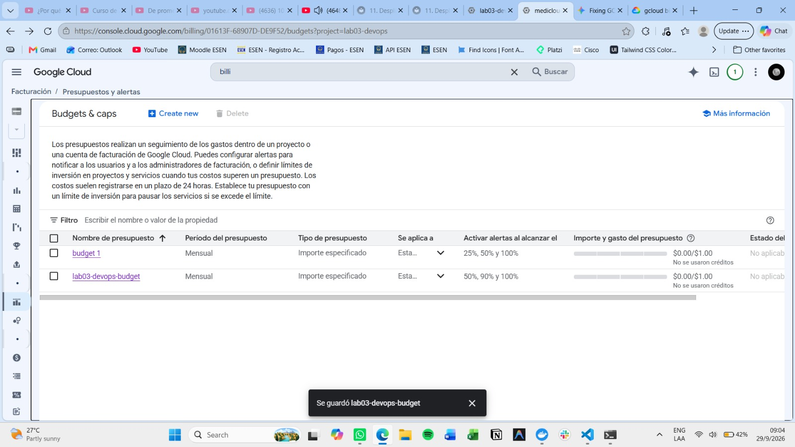

# Evidencias

## Laboratorio 2. Integración continua

### 19.1 Pipeline final

El workflow `.github/workflows/ci.yml` corre en cada `push` a `main` y en cada
`pull_request` cuyo destino es `main`. Tres jobs:

- **Lint**: instala `requirements-dev.txt` y ejecuta `python -m ruff check .`.
  Responsable de análisis estático de estilo/errores.
- **Test**: instala `requirements-dev.txt`, ejecuta `pytest` con cobertura sobre
  el paquete `app` (`--cov=app --cov-report=xml`) y publica `coverage.xml` como
  artifact. Responsable de las pruebas automatizadas y su cobertura.
- **Container**: construye la imagen Docker y la etiqueta con el SHA del commit
  (`incident-api:${{ github.sha }}`). Responsable de verificar que el proyecto
  es empaquetable.

`Lint` y `Test` no dependen entre sí y se ejecutan en paralelo. `Container`
depende de ambos (`needs: [Lint, Test]`) y solo corre si los dos terminan con éxito.

### 19.2 Fallo de lint

- Enlace a la ejecución: <link https://github.com/astrid-esen/lab02-devops/pull/3>
- Cambio que provocó el fallo: el cambio que provoco el fallo fue agregar una variable que no se ocupaba en el archivo de main.py.
  <link https://github.com/astrid-esen/lab02-devops/actions/runs/36290134183/job/108538505736?pr=3>
- Evidencia de que `Container` no se ejecutó: <link https://github.com/astrid-esen/lab02-devops/actions/runs/36290134183/job/108538568047?pr=3>
- Evidencia de que el merge quedó bloqueado: <link https://github.com/astrid-esen/lab02-devops/pull/3>

### 19.3 Fallo de pruebas

- Enlace a la ejecución: <link https://github.com/astrid-esen/lab02-devops/pull/3>
- Cambio que provocó el fallo: se agregó temporalmente assert 1 == 2 dentro del archivo test/test_temporal.py
- Evidencia de que `Container` no se ejecutó: <link https://github.com/astrid-esen/lab02-devops/actions/runs/36291366211/job/108541964579?pr=3>
- Evidencia de que el merge quedó bloqueado: <link https://github.com/astrid-esen/lab02-devops/actions/runs/36291366211/job/108541964579?pr=3>

### 19.4 Ejecución satisfactoria

- Enlace a la ejecución con los tres jobs satisfactorios: <link https://github.com/astrid-esen/lab02-devops/actions/runs/36294002015>
- Enlace al pull request utilizado para integrar el laboratorio: <link https://github.com/astrid-esen/lab02-devops/pull/3>
- SHA del commit final evaluado: fab9c9f322811b8ed2e3fa186401d045ee98c98b

### 19.5 Artifact
- **Identificación:** El reporte de cobertura en formato XML fue configurado para conservarse como un workflow artifact. 
- **Evidencia:** Se generó el artefacto con el nombre `coverage-report` (que contiene el archivo `coverage.xml`). Este se puede visualizar y descargar desde la sección "Artifacts" en el resumen de cualquier ejecución exitosa del pipeline en GitHub Actions. <link https://github.com/astrid-esen/lab02-devops/actions/runs/36289348274>

### 19.6 Caché

- Enlace a una ejecución donde se observa reutilización de caché: <link https://github.com/astrid-esen/lab02-devops/actions/runs/36294002015/job/108549336594>
- Qué cambio invalida la caché: la clave de caché está atada al hash de
  `requirements.txt` y `requirements-dev.txt` (`cache-dependency-path`). Modificar
  cualquiera de esos dos archivos (agregar, quitar o cambiar de versión una
  dependencia) genera una nueva clave y fuerza a reconstruir la caché.

## Laboratorio 3. Entrega continua y despliegue en la nube

### 14.1 Preparación del entorno

- **ID del proyecto GCP:** `lab03-devops`
- **Captura del presupuesto USD 1**

- **Service accounts creadas** (`gcloud iam service-accounts list --project=lab03-devops`):

  ```
  EMAIL                                                      DISABLED
  gha-deployer@lab03-devops.iam.gserviceaccount.com          False
  gha-publisher@lab03-devops.iam.gserviceaccount.com         False
  incident-api-runtime@lab03-devops.iam.gserviceaccount.com  False
  ```

- **Cleanup policy en Artifact Registry** (`devops-images`, `gcloud artifacts repositories list-cleanup-policies`):

  ```json
  [
    {
      "action": {"type": "DELETE"},
      "condition": {"olderThan": "259200s", "tagState": "ANY"},
      "name": "delete-old-versions"
    },
    {
      "action": {"type": "KEEP"},
      "condition": {"tagPrefixes": ["baseline"], "tagState": "TAGGED"},
      "name": "keep-baseline"
    },
    {
      "action": {"type": "KEEP"},
      "mostRecentVersions": {"keepCount": 3},
      "name": "keep-recent"
    }
  ]
  ```

- **Revisión inicial `incident-api-baseline`**: desplegada y activa en el servicio `incident-api` (`us-central1`), con `incident-api-runtime` como identidad de ejecución y `STORAGE_BACKEND=firestore`.
- **Verificación inicial `/health` e `/incidents`** contra la URL principal (`https://incident-api-wr62lcvkua-uc.a.run.app`):

  ```
  GET /health     -> {"status":"ok"}
  GET /incidents  -> []
  ```

### 14.2 Publicación

- **Enlace a la ejecución de GitHub Actions:** <https://github.com/astrid-esen/lab02-devops/actions/runs/36606113143>
- **SHA del commit:** `746934f71ea784a2fb275df2be66e8448247c128`
- **Tag utilizado en Artifact Registry:** `746934f71ea784a2fb275df2be66e8448247c128` (SHA completo del commit, sin usar `latest`)
- **Referencia completa de la imagen:** `us-central1-docker.pkg.dev/lab03-devops/devops-images/incident-api:746934f71ea784a2fb275df2be66e8448247c128`
- **Digest obtenido tras publicar:** `sha256:a27ae6d4e1464612ed4acea082739de0973596d50c86ccc5126c10d6632ee085`
- **Evidencia de autenticación sin llave JSON:** el job `Publish` se autentica con `google-github-actions/auth@v3` usando `WIF_PROVIDER` y `PUBLISHER_SERVICE_ACCOUNT` (OIDC); las credenciales quedan en un archivo temporal (`gha-creds-*.json`) generado por la propia acción para la duración del job, nunca almacenado como secret ni commiteado (está excluido en `.gitignore`/`.dockerignore`).

### 14.3 Revisión candidata

- **Nombre de la revisión:** `incident-api-746934f7`
- **URL asociada al tag `candidate`:** `https://candidate---incident-api-wr62lcvkua-uc.a.run.app`
- **Resultado `GET /health`:** `{"status":"ok"}`
- **Resultado `GET /incidents`:** `[]`
- **Evidencia de 0% de tráfico antes de la promoción** (`gcloud run services describe incident-api --format="yaml(status.traffic)"`):

  ```yaml
  status:
    traffic:
    - revisionName: incident-api-746934f7
      tag: candidate
      url: https://candidate---incident-api-wr62lcvkua-uc.a.run.app
    - percent: 100
      revisionName: incident-api-baseline
  ```

  La revisión candidata no recibe porcentaje de tráfico principal; `incident-api-baseline` conserva el 100%.

### 14.4 Promoción

_Pendiente: se completa al ejecutar `promote.yml`._

### 14.5 Rollback

_Pendiente: se completa al ejecutar `rollback.yml`._

### 14.6 Explicación técnica

_Pendiente._